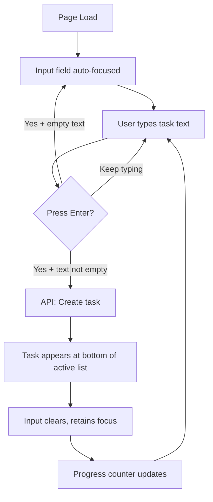
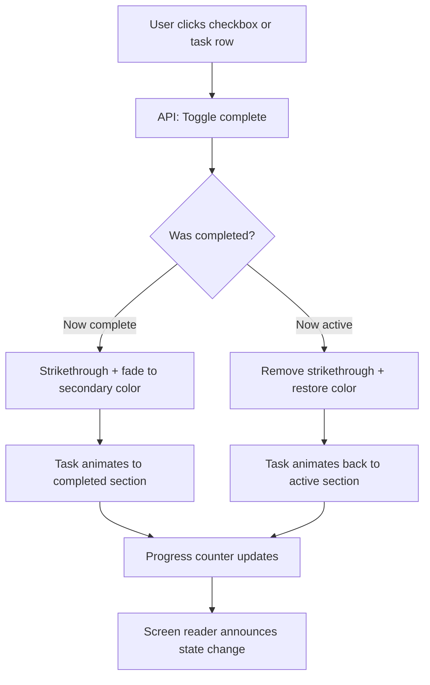
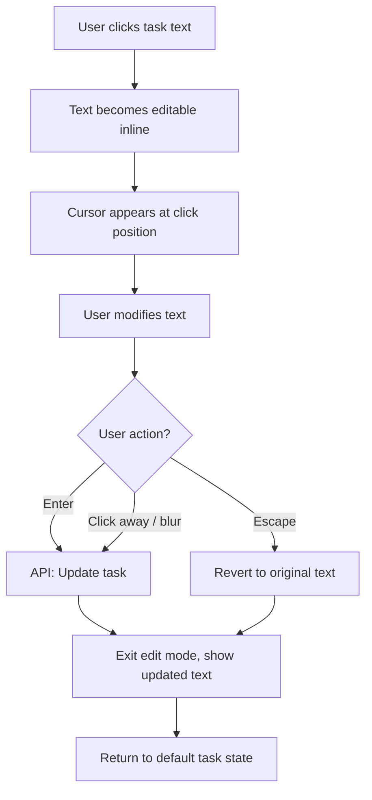
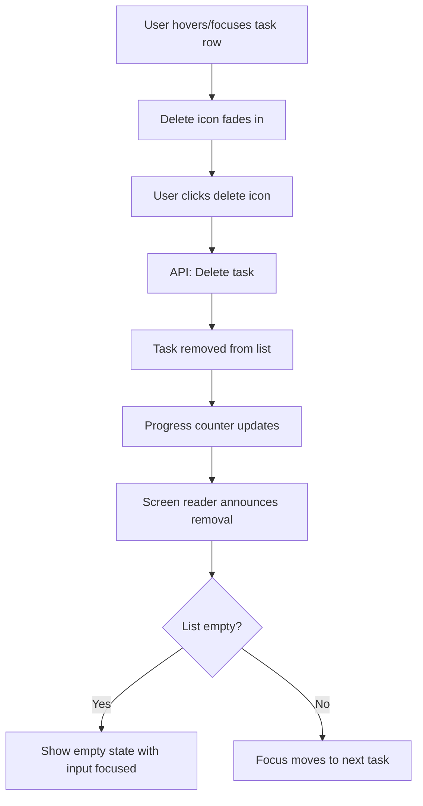

---
stepsCompleted:
  - step-01-init
  - step-02-discovery
  - step-03-core-experience
  - step-04-emotional-response
  - step-05-inspiration
  - step-06-design-system
  - step-07-defining-experience
  - step-08-visual-foundation
  - step-09-design-directions
  - step-10-user-journeys
  - step-11-component-strategy
  - step-12-ux-patterns
  - step-13-responsive-accessibility
  - step-14-complete
inputDocuments:
  - prd.md
---

# UX Design Specification - bmad

**Author:** Andrej
**Date:** 2026-04-29

---

<!-- UX design content will be appended sequentially through collaborative workflow steps -->

## Executive Summary

### Project Vision

A todo app that feels like a blank sheet of paper — you see it, you know what to do. Zero learning curve, zero visual noise. The app should feel like it was always there, ready, and disappear from your mind the moment you close the tab.

### Target Users

Tech-savvy solo individuals (developers, students, planners) working at desktops. They have zero patience for onboarding or configuration. They expect things to work immediately and intuitively. They've been burned by apps that over-explain and under-deliver.

### Key Design Challenges

- **Instant comprehension:** The UI must communicate its full capability set at a glance — no tooltips, no tutorials, no "getting started" flows. If a user hesitates, the design has failed.
- **Edit affordance:** Inline editing must feel natural without explicit "edit" buttons cluttering the interface. The interaction model needs to signal editability without visual overhead.
- **WCAG AA compliance without visual weight:** Focus indicators, contrast ratios, and ARIA support must be achieved without making the interface feel heavy or clinical.

### Design Opportunities

- **Emotional simplicity:** A minimal, friendly, light and soft aesthetic that feels calm rather than stark. Rounded edges, gentle colors, generous whitespace — the app should feel inviting, not cold.
- **Micro-interactions as delight:** Subtle animations on task completion (a gentle check, a soft strikethrough) can create small moments of satisfaction without adding complexity.
- **Progressive disclosure through interaction:** No visible buttons until needed — hover/focus reveals actions, keeping the resting state ultra-clean.

## Core User Experience

### Defining Experience

The core loop is: **add task → work → check off → see progress**. Adding a task is the most frequent action and must be the most frictionless — type text, hit enter, done. Seeing the count of completed vs total tasks provides a constant sense of momentum. The app's entire value lives in this tight loop.

### Platform Strategy

- **Platform:** Web (browser-based SPA), desktop-first
- **Input:** Mouse and keyboard — keyboard is primary for task creation
- **Touch:** Functional on tablet/mobile but not optimized for it
- **Offline:** Not required — in-memory backend means no offline scenario
- **No routing:** Single view, single page — no navigation needed

### Effortless Interactions

- **Adding a task:** Type into an always-visible input field, press enter. No click to "new task," no modal, no multi-step flow. The input field is the first thing you see and already has focus on page load.
- **Completing a task:** Single click/tap on the task or its checkbox. Toggle — click again to uncomplete.
- **Removing a task:** Action appears on hover/focus — one click to remove. No confirmation dialog.
- **Editing a task:** Click the task text to enter edit mode inline. No separate edit screen or modal.

### Critical Success Moments

- **First 3 seconds:** User lands on the page and immediately understands how to add a task. The input field is obvious, inviting, and ready. If they hesitate, the design has failed.
- **First completion:** Checking off a task and seeing the completed/total count update provides instant feedback — "this is working, I'm making progress."
- **Session end:** All tasks checked off. The count reads "done." Close the tab with a sense of accomplishment.

### Experience Principles

1. **Zero-thought input:** Adding a task should require no decision-making — just type and go
2. **Constant progress signal:** The completed/total count is always visible, always current
3. **Invisible chrome:** UI controls stay out of the way until needed — the task list is the interface
4. **Forgiveness over confirmation:** No "are you sure?" dialogs — actions are immediate, and the undo is re-adding or toggling

## Desired Emotional Response

### Primary Emotional Goals

- **Calm focus:** The app should feel like clearing your desk before working — a moment of quiet organization that reduces mental noise
- **In control:** The user always knows exactly what's on their plate and what's left. No surprises, no hidden state
- **Unburdened:** The app takes things out of your head and holds them. That transfer of mental load is the core emotional payoff

### Emotional Journey Mapping

- **First visit:** Clarity — "I immediately know what this is and what to do"
- **Adding tasks:** Relief — "It's out of my head now, I can stop worrying about forgetting"
- **Working through the list:** Momentum — each checkoff builds a quiet sense of progress
- **All tasks done:** Satisfaction — a simple sense of "done." Not celebration, not fanfare — just done
- **Closing the tab:** Lightness — nothing follows you. No notifications tomorrow, no guilt about an abandoned list

### Micro-Emotions

- **Confidence over confusion:** Every interaction should feel obvious. Never "did that work?" or "where did it go?"
- **Accomplishment over frustration:** Checking things off should always feel good. Never feel like a chore
- **Calm over anxiety:** No urgency signals, no red indicators, no alarming empty states. The app stays neutral and patient

### Design Implications

- **Calm focus** → Soft color palette, generous whitespace, no competing visual elements
- **In control** → Always-visible task count (completed/total), clear task states, predictable behavior
- **Unburdened** → Instant task addition, no confirmation steps, no "are you sure?" — just do it
- **No overwhelm** → Empty state should feel inviting ("What are you working on?"), not empty or broken. Long task lists should remain scannable without visual density

### Emotional Design Principles

1. **Quiet over loud:** No celebration animations, no confetti, no streaks. A subtle check mark is enough.
2. **Patient over urgent:** The app never pressures. No timers, no overdue indicators, no priority colors.
3. **Present over persistent:** Everything is about right now. No history, no "you left tasks unfinished last time."

## UX Pattern Analysis & Inspiration

### Inspiring Products Analysis

**Apple / macOS Design Language:**
- Consistent, quiet visual hierarchy — you always know what's important without being told
- Generous whitespace and soft shadows create depth without clutter
- Animations are functional, not decorative — they show where things came from and where they went
- Typography does the heavy lifting — weight and size establish hierarchy, not color or borders
- System-wide consistency means zero learning curve within the ecosystem

**Clear (iOS Todo App):**
- Gesture-driven, minimal chrome — the list *is* the interface
- Adding tasks feels instant — pull down to create, type, done
- Color-coded heat map for priority creates visual meaning without labels
- No buttons, no toolbars — interactions are discovered through gestures
- Satisfying haptics and micro-animations on task completion

### Transferable UX Patterns

**From Apple/macOS:**
- **Soft depth through shadows:** Subtle card elevation or input field depth rather than hard borders — supports the light/soft aesthetic
- **Typography-driven hierarchy:** Use font weight and size to create structure, not color or lines
- **Functional animation:** Smooth transitions when tasks are added, completed, or removed — show cause and effect
- **System font (SF Pro / system stack):** Feels native and familiar without custom font loading

**From Clear:**
- **List-is-the-interface:** The task list dominates the view. No sidebars, no headers competing for attention
- **Instant add pattern:** Input always visible and ready — no "+" button to find first
- **Completion satisfaction:** A subtle visual reward on checkoff (strikethrough, fade, gentle animation)

### Anti-Patterns to Avoid

- **Feature-heavy toolbars:** No top bars full of filter, sort, search, settings icons — conflicts with "invisible chrome" principle
- **Modal dialogs for simple actions:** No "confirm delete?" popups — breaks the calm, patient emotional goal
- **Onboarding overlays:** No "welcome! here's how to use this" — if the UI needs explaining, it's too complex
- **Dense information display:** No due dates, priorities, tags, or categories cluttering each task row — conflicts with the unburdened emotional goal
- **Aggressive empty states:** No sad faces or "you have no tasks!" messaging — keep it inviting and neutral

### Design Inspiration Strategy

**Adopt:**
- Apple's soft depth and typography-driven hierarchy — directly supports the light/friendly aesthetic
- Clear's list-is-the-interface philosophy — aligns with invisible chrome principle
- Functional micro-animations on task state changes — supports the momentum emotional journey

**Adapt:**
- Clear's gesture-driven approach → simpler click/keyboard interactions (our users are on desktop, not mobile)
- Apple's system font stack → use it for zero-config typography that feels native

**Avoid:**
- Clear's color-coded priority system — we have no priorities by design
- Any pattern requiring discovery through hidden gestures — desktop users expect visible affordances on hover/focus

## Design System Foundation

### Design System Choice

**Chakra UI** — a themeable React component library with built-in accessibility, flexible theming, and composable components.

### Rationale for Selection

- **WCAG AA by default:** Focus management, ARIA attributes, keyboard navigation, and screen reader support built into every component — reduces accessibility implementation effort significantly
- **Themeable to match aesthetic:** Chakra's theme system supports the soft, light, Apple-inspired look through custom tokens (border radius, shadows, colors, spacing)
- **Right-sized for the project:** Provides exactly the components needed (Input, Checkbox, IconButton, Stack, Text) without heavy overhead
- **Solo developer friendly:** Well-documented, widely adopted in React ecosystem, reduces boilerplate for accessible interactions
- **Tree-shakeable:** Only imports what's used — keeps bundle size manageable

### Implementation Approach

- Install `@chakra-ui/react` and required peer dependencies
- Create a custom theme extending Chakra's default with the soft/light design tokens
- Use Chakra's built-in components for all interactive elements (Input, Checkbox, Button, List)
- Leverage Chakra's `useColorModeValue` if a future dark mode is ever considered (not in scope but free)
- No additional CSS framework needed — Chakra's style props handle all styling

### Customization Strategy

- **Theme tokens:** Define custom `colors`, `radii`, `shadows`, and `fonts` to achieve the warm, soft aesthetic
- **Component variants:** Create custom variants for task items (default, completed, editing) using Chakra's variant system
- **Spacing scale:** Use generous spacing values aligned with the "whitespace as design element" principle
- **Focus styles:** Customize focus ring to be visible but soft — colored outline rather than harsh browser default
- **No global CSS overrides:** Keep all styling within Chakra's theme system for consistency

## Detailed Core Experience

### Defining Experience

**"Type it, enter, done."** The app's identity in one interaction. The input field is always visible, always focused on first load. Type a task, press enter, it appears at the bottom of the list. No modes, no menus, no extra steps.

### User Mental Model

Users bring the mental model of a **paper notepad** — you write things down in order, cross them off as you go, finished items drift to the bottom of your attention. The app mirrors this:
- New tasks append to the bottom (like writing the next line)
- Completed tasks move to the bottom (like crossed-off items you stop looking at)
- The list reads top-down: what's next is always at the top

### Success Criteria

- User adds their first task without hesitation — the input field's purpose is immediately obvious
- Completed tasks move to the bottom without confusing the user — the transition should feel natural, not jarring
- The progress counter ("3 of 7 done") provides ambient awareness without demanding attention
- Editing a task feels as natural as fixing a typo — click the text, change it, done

### UX Patterns

All interactions use **established patterns** — no novel UX requiring education:
- Text input + enter to submit (universal web pattern)
- Checkbox to toggle completion (universal)
- Click text to edit inline (familiar from spreadsheets, Notion, etc.)
- Hover to reveal delete action (familiar from email clients, file managers)
- List reordering: completed items auto-sort to bottom (familiar from iOS Reminders)

### Experience Mechanics

**1. Adding a Task:**
- Input field is visible at top, auto-focused on page load
- Placeholder text: "What are you working on?" (inviting, not instructional)
- User types task text, presses Enter
- Task appears at bottom of the active (uncompleted) task list
- Input field clears and retains focus for rapid entry
- Progress counter updates immediately

**2. Completing a Task:**
- Click checkbox or task row to toggle complete
- Task gets a subtle strikethrough and fades slightly
- Task smoothly animates to the bottom section (below active tasks)
- Progress counter updates ("4 of 7 done")
- Uncompleting: click again — task moves back to the active section

**3. Editing a Task:**
- Click task text to enter inline edit mode
- Text becomes editable in place — cursor appears where clicked
- Press Enter or click away to save
- Press Escape to cancel edit
- No visual mode change beyond the text cursor — keeps it lightweight

**4. Removing a Task:**
- Delete icon appears on hover/focus (invisible at rest)
- Single click removes the task immediately
- No confirmation dialog — forgiveness over confirmation
- Progress counter updates
- If task list becomes empty, return to empty state

**5. Empty State:**
- Friendly placeholder: "What are you working on?" in the input
- No illustration, no explanation — just the ready input field
- The emptiness itself communicates simplicity

## Visual Design Foundation

### Color System

**Palette Philosophy:** Light, warm, and soft — inspired by Apple's design language. Neutral backgrounds with a single accent color for interactive elements. No harsh contrasts, no saturated colors competing for attention.

**Core Colors:**
- **Background:** `#FAFAFA` (warm off-white — softer than pure white)
- **Surface/Card:** `#FFFFFF` (white, with subtle shadow for depth)
- **Text Primary:** `#1D1D1F` (Apple's near-black — warm, not harsh)
- **Text Secondary:** `#6E6E73` (Apple's secondary gray — for completed tasks, hints)
- **Accent/Primary:** `#007AFF` (Apple blue — for checkboxes, focus rings, interactive elements)
- **Accent Hover:** `#0066D6` (darker blue for hover states)
- **Success/Complete:** `#34C759` (Apple green — subtle use for completion indicators)
- **Danger/Delete:** `#FF3B30` (Apple red — only for delete icon on hover)
- **Border:** `#E5E5EA` (light gray — soft dividers between tasks)
- **Input Background:** `#F2F2F7` (Apple's grouped background — for the input field)

**WCAG AA Compliance:**
- `#1D1D1F` on `#FAFAFA` → contrast ratio ~15.4:1 (passes AAA)
- `#6E6E73` on `#FFFFFF` → contrast ratio ~4.6:1 (passes AA)
- `#007AFF` on `#FFFFFF` → contrast ratio ~4.5:1 (passes AA for large text; pair with text label for small text)

### Typography System

**Font Stack:** System fonts — native to each OS, zero loading time, feels familiar.

```
font-family: -apple-system, BlinkMacSystemFont, "Segoe UI", Roboto, Helvetica, Arial, sans-serif;
```

**Type Scale:**
- **App title/header:** 20px, font-weight 600 (semibold)
- **Progress counter:** 14px, font-weight 500 (medium), secondary text color
- **Task text (active):** 16px, font-weight 400 (regular)
- **Task text (completed):** 16px, font-weight 400, secondary text color, strikethrough
- **Input placeholder:** 16px, font-weight 400, secondary text color
- **Empty state text:** 16px, font-weight 400, secondary text color

**Line Height:** 1.5 for body text — comfortable reading without feeling loose.

### Spacing & Layout Foundation

**Base Unit:** 8px — all spacing is multiples of 8.

**Spacing Scale:**
- `xs`: 4px (tight internal padding)
- `sm`: 8px (between related elements)
- `md`: 16px (standard component padding)
- `lg`: 24px (between sections)
- `xl`: 32px (major section breaks)
- `2xl`: 48px (page-level margins)

**Layout:**
- Centered single-column layout, max-width 600px
- Generous top margin (80-100px) — the list floats in the upper-center, not crammed to the top
- Task items: 16px vertical padding, 16px horizontal padding
- Input field: 16px padding, sits above the task list with `lg` gap below
- Border radius: 12px for cards/input, 6px for checkboxes — soft, rounded, friendly

**Visual Depth:**
- Input field: subtle inset shadow (`inset 0 1px 2px rgba(0,0,0,0.05)`)
- Task list container: light elevation shadow (`0 1px 3px rgba(0,0,0,0.08)`)
- No hard borders — shadows create separation

### Accessibility Considerations

- All color combinations verified against WCAG AA minimum contrast ratios
- Focus rings use `#007AFF` with 2px offset — visible on both light backgrounds and white surfaces
- Interactive elements have minimum 44x44px touch/click targets
- Strikethrough on completed tasks paired with color change (secondary gray) — not color-only differentiation
- Delete icon uses red only as enhancement — icon shape communicates action independently

## Design Direction Decision

### Design Directions Explored

Three layout approaches were evaluated against the established visual foundation:
- **Direction A: "Floating Card"** — centered card container with soft shadow, structured and contained
- **Direction B: "Borderless"** — tasks float directly on background, document-like feel
- **Direction C: "Segmented"** — explicit sections separating active and completed tasks

### Chosen Direction

**Direction A: "Floating Card"** — The task list lives inside a centered white card with soft elevation shadow, floating on the warm off-white background.

**Layout Structure (top to bottom):**
1. App title (small, subtle, top of card)
2. Progress counter ("3 of 7 done") — right-aligned or below title
3. Input field with placeholder "What are you working on?"
4. Active tasks — each as a row with checkbox, text, and hidden delete action
5. Completed tasks — same rows but faded, strikethrough, grouped at bottom
6. Soft divider line separates active from completed (no section labels)

### Design Rationale

- **Contained feel:** The card creates a clear boundary for the app — it feels like a discrete tool, not a webpage. Matches the "scratch pad" mental model.
- **Visual focus:** The white card on off-white background naturally draws the eye to the content. Nothing else competes.
- **Apple alignment:** Floating cards with soft shadows are a core Apple design pattern (Settings, Notes, Reminders). Feels immediately familiar.
- **Scalable simplicity:** The card container holds the layout together whether there are 2 tasks or 20, without the list feeling like it's floating loose on the page.

### Implementation Approach

- Single `Container` (max-width 600px) centered on page with top margin
- `Box` with white background, 12px border-radius, soft shadow for the card
- `VStack` inside for vertical task layout
- Chakra `Divider` between active and completed sections (subtle, no label)
- All interactions (add, edit, complete, remove) happen within the card — no modals, no panels, no navigation

## User Journey Flows

### Task Creation Flow



**Key decisions:** Empty submissions are silently ignored — no error, no shake, no red border. The input just stays focused. Rapid entry is supported: type, enter, type, enter — no pause needed.

### Task Completion Flow



**Key decisions:** Toggle is instant — same action to complete and uncomplete. Animation duration ~200ms — fast enough to feel responsive, slow enough to show where the task went.

### Task Edit Flow



**Key decisions:** Escape reverts — no data lost. Enter and blur both save. No explicit save button. No visual mode change beyond the text cursor appearing.

### Task Deletion Flow



**Key decisions:** No confirmation dialog. Delete icon only visible on hover/focus — invisible at rest. When a task is deleted, keyboard focus moves to the next task in the list (accessibility).

### Journey Patterns

**Consistent across all flows:**
- **Immediate feedback:** Every action produces a visible result within 100ms
- **API-first:** All mutations go through the API — frontend reflects backend state
- **Focus management:** After every action, focus lands somewhere logical (input field after add, next task after delete)
- **Screen reader announcements:** All state changes (add, complete, uncomplete, delete) announced via ARIA live regions
- **No dead ends:** Every flow returns the user to a state where they can take the next action

### Flow Optimization Principles

1. **Zero-confirm:** No action requires a second click to confirm. Every interaction is a single action.
2. **Recoverable:** Editing supports escape-to-revert. Completion is a toggle. Only deletion is permanent — and even that is just "re-add it."
3. **Keyboard-complete:** Every flow works entirely via keyboard — Tab to navigate, Enter to submit/save, Escape to cancel, Space to toggle checkbox.
4. **Animation as wayfinding:** Transitions show where tasks move (active → completed, completed → active) so the user never loses track of what happened.

## Component Strategy

### Design System Components

**Chakra UI provides these foundation components:**

| Chakra Component | Usage in App |
|---|---|
| `Container` | Centered page layout, max-width 600px |
| `Box` | Card container with shadow and border-radius |
| `VStack` | Vertical task list layout |
| `HStack` | Horizontal layout within task rows |
| `Input` | Base for TaskInput component |
| `Checkbox` | Task completion toggle |
| `IconButton` | Delete action button |
| `Text` | Task text, progress counter, empty state |
| `Divider` | Separator between active and completed sections |
| `Heading` | App title |

### Custom Components

**TaskInput**

- **Purpose:** Always-visible input for adding new tasks
- **Anatomy:** Chakra `Input` with custom placeholder, auto-focus on mount
- **States:** Empty (placeholder visible), typing (text entered), submitting (enter pressed → clears)
- **Behavior:** Enter submits if text is non-empty, clears input, retains focus. Empty enter is silently ignored.
- **Accessibility:** Label via `aria-label="Add a new task"`, placeholder "What are you working on?"

**TaskItem**

- **Purpose:** Single task row displaying task state and actions
- **Anatomy:** `HStack` containing Checkbox, editable Text, and IconButton (delete)
- **States:**
  - *Default:* Checkbox unchecked, primary text color, delete icon hidden
  - *Hovered/Focused:* Delete icon fades in
  - *Completed:* Checkbox checked, text strikethrough, secondary text color, delete icon hidden until hover
  - *Editing:* Text becomes editable input, cursor visible, Enter saves, Escape reverts
- **Accessibility:** Each row is a list item (`li`). Checkbox has `aria-label` with task text. Delete button has `aria-label="Delete task: {task text}"`. Focus moves to next task after deletion.

**ProgressCounter**

- **Purpose:** Ambient progress indicator showing completion status
- **Anatomy:** `Text` component displaying "{completed} of {total} done"
- **States:**
  - *No tasks:* Hidden (not rendered)
  - *Tasks exist:* Shows count in secondary text color, 14px, medium weight
  - *All complete:* Shows "{total} of {total} done"
- **Accessibility:** `aria-live="polite"` — announces count changes to screen readers without interrupting

**TaskList**

- **Purpose:** Container managing the two-section layout (active tasks above, completed tasks below)
- **Anatomy:** `VStack` with active tasks section, Chakra `Divider` (only when both sections have items), completed tasks section
- **States:**
  - *Empty:* No list rendered, just the input with placeholder
  - *Active only:* Active tasks listed, no divider
  - *Mixed:* Active tasks, divider, completed tasks
  - *All complete:* Divider, completed tasks only
- **Behavior:** Tasks animate between sections on completion toggle (~200ms transition)
- **Accessibility:** Rendered as `ul` with `role="list"`. Section changes announced via ARIA live region.

### Component Implementation Strategy

- All custom components built by composing Chakra primitives — no raw HTML or custom CSS
- All styling through Chakra's theme tokens and style props — no inline styles or CSS files
- Each component in its own file for clarity and testability
- Component props are minimal — only what's needed, no over-abstraction

### Implementation Roadmap

All components ship in a single release. Build order based on dependency:

1. **TaskInput** — standalone, no dependencies
2. **TaskItem** — standalone, no dependencies
3. **ProgressCounter** — standalone, no dependencies
4. **TaskList** — composes TaskItem, depends on it being built first
5. **App shell** — composes all components within the Card layout

## UX Consistency Patterns

### Feedback Patterns

**Success Feedback:**
- No toast notifications, no banners, no modals — the UI change *is* the feedback
- Task added → it appears in the list (visual confirmation)
- Task completed → strikethrough + moves to bottom (visual confirmation)
- Task edited → text updates in place (visual confirmation)
- Task deleted → it disappears (visual confirmation)
- Progress counter updates on every mutation — ambient confirmation

**Error Feedback:**
- API failure → task reverts to previous state silently (optimistic UI rollback)
- No red error banners or toast messages for a simple utility — if something fails, the UI just doesn't change
- Invalid input (empty task) → silently ignored, no error indication

**Principle:** The state of the list *is* the feedback. If you can see it happened, that's enough.

### Form Patterns

**Input Field (TaskInput):**
- Single input, always visible, no labels (placeholder serves as label for sighted users, `aria-label` for screen readers)
- Submit on Enter — no submit button visible
- No character limit indicator — tasks are short by nature
- No validation messages — empty submit is simply ignored
- Input clears after successful submit, retains focus

**Inline Edit (TaskItem):**
- Click to edit — no edit button, no edit icon
- Save on Enter or blur
- Cancel on Escape (reverts to original)
- No save/cancel buttons visible — keyboard interaction only
- No character counter or validation — same rules as creation

### Empty & Loading States

**Empty State (no tasks):**
- Just the input field with placeholder "What are you working on?"
- No illustrations, no onboarding text, no "get started" messaging
- The empty card with the input field is the invitation to begin

**Loading State:**
- No loading spinner or skeleton screen — the in-memory backend responds near-instantly
- Page renders with empty state, tasks appear on first API response
- If API is slower than expected, the empty state is an acceptable brief flash

**All Tasks Complete:**
- Progress counter shows "{total} of {total} done"
- All tasks visible in completed section with strikethrough
- Input field still ready for new tasks — no "congratulations" overlay

### Interaction Timing

- **Animation duration:** 200ms for task movement between sections (CSS transition)
- **Hover delay:** 0ms — delete icon appears immediately on hover/focus
- **Debounce:** None — every action fires immediately
- **Focus transitions:** Immediate — no delay between action and focus placement

## Responsive Design & Accessibility

### Responsive Strategy

**Desktop-first design.** The primary use case is developers at workstations. The single-column card layout (max-width 600px) naturally constrains content, so responsive adaptation is minimal.

**Desktop (1024px+):**
- Centered floating card with off-white background visible on sides
- Max-width 600px, generous top margin (80-100px)
- Full hover states for delete icon reveal

**Tablet (768px - 1023px):**
- Same floating card layout — 600px fits comfortably
- Touch targets already meet 44x44px minimum
- Hover states supplemented by always-visible delete icons (no hover on touch)

**Mobile (< 768px):**
- Card goes full-width with 16px horizontal padding
- No floating effect — card fills the viewport width
- Top margin reduced (32px) to maximize content area
- Touch targets remain 44x44px minimum
- Delete icon always visible (no hover on touch devices)

### Breakpoint Strategy

| Breakpoint | Layout Change |
|---|---|
| < 768px | Card full-width with padding, reduced top margin, delete icons always visible |
| >= 768px | Floating card centered, max-width 600px, hover-reveal delete icons |

Two breakpoints only. Chakra's responsive style props handle this via array syntax — no custom media queries needed.

### Accessibility Strategy

**WCAG AA compliance** — verified through automated testing and manual review.

**Keyboard Navigation:**
- Tab order: Input field → first task checkbox → first task text → first task delete → next task... → loop
- Enter: Submit new task / save edit
- Escape: Cancel edit (revert)
- Space: Toggle checkbox when focused
- All interactive elements reachable and operable via keyboard

**Screen Reader Support:**
- Semantic HTML: `main`, `h1`, `ul`, `li`, `input`, `button`, `checkbox`
- `aria-label` on input ("Add a new task"), delete buttons ("Delete task: {text}"), checkboxes ("{task text}")
- `aria-live="polite"` on progress counter — announces count changes
- `aria-live="polite"` on task list region — announces additions and removals
- Completed tasks announced via checkbox state change

**Visual Accessibility:**
- All text meets 4.5:1 contrast ratio against backgrounds
- Focus rings: 2px solid `#007AFF` with offset — visible on all backgrounds
- Strikethrough paired with color change — not color-only differentiation
- No information conveyed by color alone

### Testing Strategy

**Automated:**
- Playwright + axe-core for WCAG AA audit on every test run
- Lighthouse accessibility score target: 90+
- Contrast ratio verification in CI

**Manual:**
- Keyboard-only navigation walkthrough (all flows)
- VoiceOver (macOS/Safari) screen reader testing
- Tab order verification

### Implementation Guidelines

- Use Chakra's responsive array props: `px={[4, 0]}`, `maxW={["100%", "600px"]}`
- Use Chakra's `useMediaQuery` or responsive props for touch-specific behavior (always-show delete)
- All ARIA attributes applied via Chakra component props
- No custom focus styles — use Chakra's `focusBorderColor` theme token set to `#007AFF`
- Test with `prefers-reduced-motion` — disable task animations for users who request it